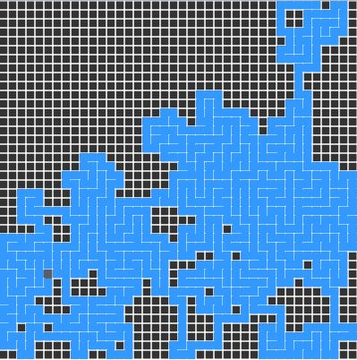

# MazeAlgorithmVisualization

## Overview

Implementation and visualization of recursive backtracker algorithm for maze creation in javaScript.

  

## Algorithm

The depth-first search algorithm of maze generation can be described with a following recursive routine:

1. Given a current cell as a parameter
2. Mark the current cell as visited
3. While the current cell has any unvisited neighbour cells
    1. Choose one of the unvisited neighbours
    2. Remove the wall between the current cell and the chosen cell
    3. Invoke the routine recursively for a chosen cell which is invoked once for any initial cell in the area.

source: Wikipedia [Maze_generation_algorithm](https://en.wikipedia.org/wiki/Maze_generation_algorithm)